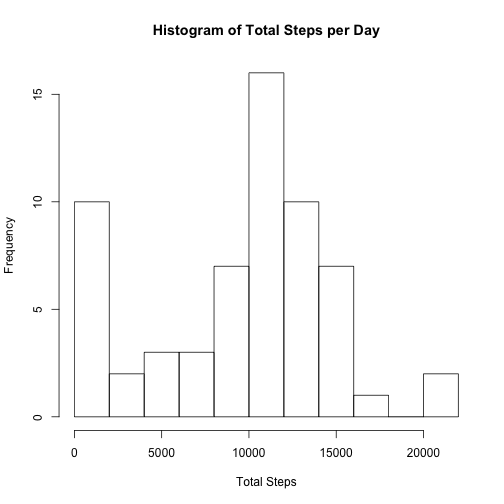
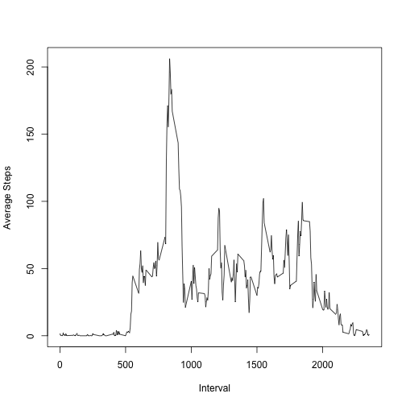
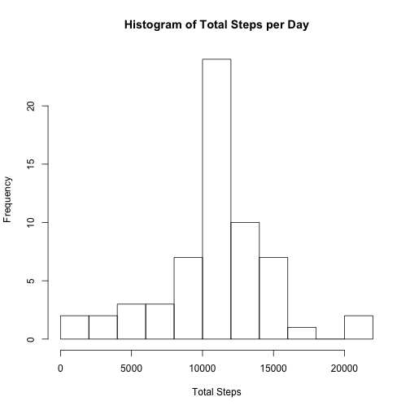
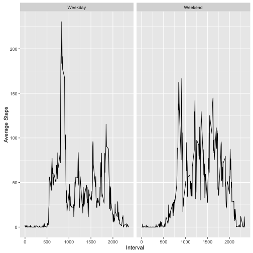

## Loading and preprocessing the data

```r
## Handle library pre-requisites
# Using dplyr for its more intuitive data frame processing
if(!require(dplyr)) install.packages("dplyr")
library(dplyr)
# Using lubridate for easier date manipulation
if(!require(lubridate)) install.packages("lubridate")
library(lubridate)
# Using ggplot2 for handling facet plots
if(!require(ggplot2)) install.packages("ggplot2")
library(ggplot2)
```


```r
#####################################################
### Loading and preprocessing the data
#####################################################
## Get zip file from provided location & extract the full data set
zipURL = "https://d396qusza40orc.cloudfront.net/repdata%2Fdata%2Factivity.zip"
temp <- tempfile()
download.file(zipURL,temp)
activityData <- read.table( unz(temp, "activity.csv"), sep = ",", 
                            header = TRUE, comment.char = "", quote = "\"")
unlink(temp)
## Convert the date column to use Date objects
activityData <- mutate(activityData, 
                       date = as.Date(ymd(as.character(date))))
```

## What is mean total number of steps taken per day?

```r
#####################################################
### What is mean total number of steps taken per day?
#####################################################
totalStepsByDate <- summarise(group_by(activityData, date), 
                              totalSteps = sum(steps, na.rm = TRUE))
hist(totalStepsByDate$totalSteps, breaks = 15, 
     xlab = "Total Steps", 
     main = "Histogram of Total Steps per Day")
```

 

```r
## Calculate mean of total steps per day
summarize(totalStepsByDate, mean(totalSteps, na.rm = TRUE))
```

```
## Source: local data frame [1 x 1]
## 
##   mean(totalSteps, na.rm = TRUE)
##                            (dbl)
## 1                        9354.23
```

```r
## Calculate median of total steps per day
summarize(totalStepsByDate, median(totalSteps, na.rm = TRUE))
```

```
## Source: local data frame [1 x 1]
## 
##   median(totalSteps, na.rm = TRUE)
##                              (int)
## 1                            10395
```

## What is the average daily activity pattern?

```r
#####################################################
### What is the average daily activity pattern?
#####################################################
aveStepsPerInterval <- summarize(group_by(activityData, interval), 
                                 aveSteps = mean(steps, na.rm = TRUE))
with(aveStepsPerInterval, plot(interval, aveSteps, type = "l", 
                               ylab = "Average Steps", 
                               xlab = "Interval"))
```

 

```r
#what it the interval with max ave steps
result <- filter(aveStepsPerInterval, aveSteps == max(aveStepsPerInterval$aveSteps))
result[1,1]
```

```
## Source: local data frame [1 x 1]
## 
##   interval
##      (int)
## 1      835
```

## Imputing missing values

```r
#####################################################
### Imputing missing values
#####################################################
# number of records with incomplete (NA) data
sum(!complete.cases(activityData))
```

```
## [1] 2304
```

```r
# the actual rows that are missing data
missingData <- activityData[!complete.cases(activityData), ]

# To fill in missing data, use the ave steps per interval across the dates to 
# fill in the steps for the missing date/interval.
# First merge the initial data set and the data frame that has the
# average steps per interval. The resulting data frame has 
# an additoional column that represents the average for that interval.
temp <- merge(activityData, aveStepsPerInterval, 
              by.x = "interval", 
              by.y = "interval", all.x = TRUE)
# Modify the data set so that any rows where steps == NA are replaced 
# with the respective average for that interval. 
# Otherwise the initial steps data is preserved.
activityDataModified <- mutate(temp, stepsRevised = ifelse(is.na(steps), aveSteps, steps))

totalStepsByDateModified <- summarise(group_by(activityDataModified, date), 
                              totalSteps = sum(stepsRevised, na.rm = TRUE))
hist(totalStepsByDateModified$totalSteps, breaks = 15, 
      xlab = "Total Steps", 
      main = "Histogram of Total Steps per Day")
```

 

```r
## Calculate mean of total steps per day
summarize(totalStepsByDateModified, mean(totalSteps, na.rm = TRUE))
```

```
## Source: local data frame [1 x 1]
## 
##   mean(totalSteps, na.rm = TRUE)
##                            (dbl)
## 1                       10766.19
```

```r
## Calculate median of total steps per day
summarize(totalStepsByDateModified, median(totalSteps, na.rm = TRUE))
```

```
## Source: local data frame [1 x 1]
## 
##   median(totalSteps, na.rm = TRUE)
##                              (dbl)
## 1                         10766.19
```

## Are there differences in activity patterns between weekdays and weekends?

```r
#####################################################
### Are there differences in activity patterns between weekdays and weekends?
#####################################################
weekendData <- mutate(activityDataModified, 
                      isWeekend = as.factor(ifelse(wday(date) %in% c(1, 7), 
                                                   "Weekend", "Weekday")))
meansByWeekend <- summarize(group_by(weekendData, isWeekend, interval), 
                            ave = mean(stepsRevised))       
g <- ggplot(meansByWeekend, aes(interval, ave))
g + geom_line() + facet_grid(. ~ isWeekend, scales = "free") + 
  labs( y = "Average Steps", x = "Interval")
```

 
